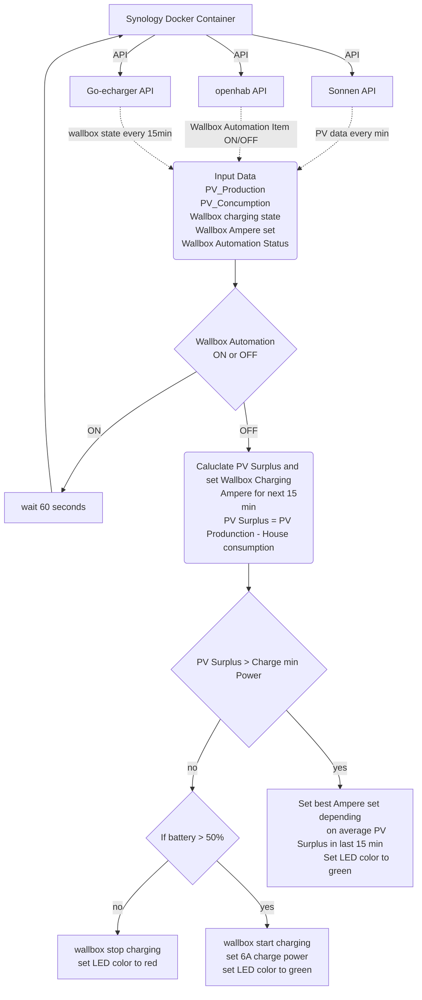

# go-eCharger PV Surplus Controller
# Overview
This is a privat project provides a solution for intelligently managing the charging of a go-eCharger wallbox by considering the surplus power generated from photovoltaic (PV) systems. It's designed to integrate with a Sonnen PV battery and can be used in conjunction with OpenHAB for home automation.

# Features
PV Surplus Calculation: Continuously monitors PV power generation and calculates surplus by accounting for current household usage.
Smart Charging: Adjusts the charging power of the go-eCharger wallbox based on real-time calculations, ensuring optimal use of surplus PV energy.
Battery Capacity Consideration: Takes into account the capacity of the connected Sonnen PV battery to maximize efficiency.
Frequent Updates: The system checks the PV power every minute and makes adjustments accordingly.

# Requirements
go-eCharger Wallbox
Sonnen PV Battery System
OpenHAB Home Automation Setup

# How It Works
PV Power Monitoring: The script checks the PV power output every minute.
Calculating Surplus: By subtracting current household usage from the PV output, it calculates the surplus power.
Loop Interaction: After 15 iterations, it calculates the average PV surplus.
Adjusting Charge Power: Based on the average surplus and battery capacity, it adjusts the charge power of the go-eCharger wallbox and LEd color to visualize the charge capability.

# Start Docker Container:

Open the Docker application on your Synology NAS.
Navigate to the 'Image' tab.
Select the option to add an image from a URL.
Download the Container:

In the URL field, enter schwabenschulle/pvcharger. This should allow you to download the container from DockerHub.

Container Configuration:

Once the container is downloaded, click 'Start' to initiate the container setup.
You will need to adjust the Volume and Environment Variables as part of the setup.

Set Volume
You need to mount a host folder to /var/log/containers

Set Environment Variables:

In the environment variables section, you need to add the URLs for your wallbox, Sonnen battery, and OpenHAB. These URLs are essential for the container to communicate with your devices.

# Verify Successful Start:
After setting up the Docker container, you can confirm that it has started successfully by opening the 'Detail' tab in the Docker application.
Within the 'Detail' tab, click on 'Protocol'. This should display logs or other information indicating the operational status of your Docker container.

