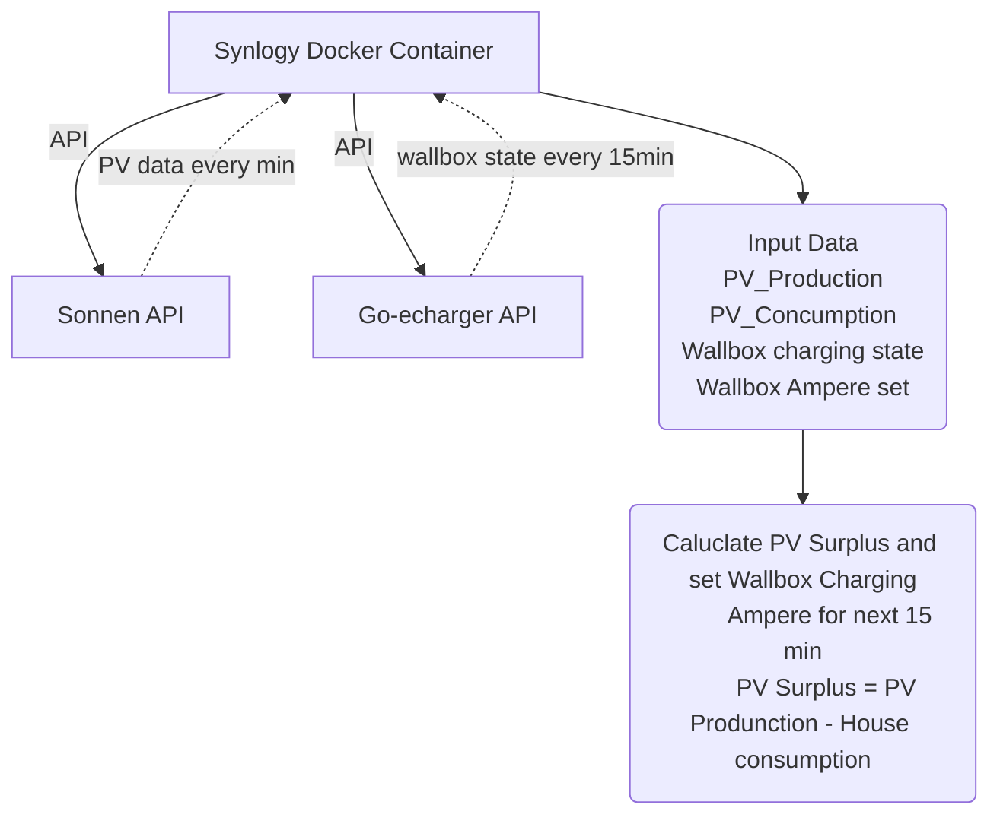

# go-eCharger PV Surplus Controller
# Overview
This is a privat project provides a solution for intelligently managing the charging of a go-eCharger wallbox by considering the surplus power generated from photovoltaic (PV) systems. It's designed to integrate with a Sonnen PV battery and can be used in conjunction with OpenHAB for home automation.

# Features
PV Surplus Calculation: Continuously monitors PV power generation and calculates surplus by accounting for current household usage.
Smart Charging: Adjusts the charging power of the go-eCharger wallbox based on real-time calculations, ensuring optimal use of surplus PV energy.
Battery Capacity Consideration: Takes into account the capacity of the connected Sonnen PV battery to maximize efficiency.
Frequent Updates: The system checks the PV power every minute and makes adjustments accordingly.

# Requirements
go-eCharger Wallbox
Sonnen PV Battery System
OpenHAB Home Automation Setup

# How It Works
PV Power Monitoring: The script checks the PV power output every minute.
Calculating Surplus: By subtracting current household usage from the PV output, it calculates the surplus power.
Loop Interaction: After 15 iterations, it calculates the average PV surplus.
Adjusting Charge Power: Based on the average surplus and battery capacity, it adjusts the charge power of the go-eCharger wallbox and LEd color to visualize the charge capability.

